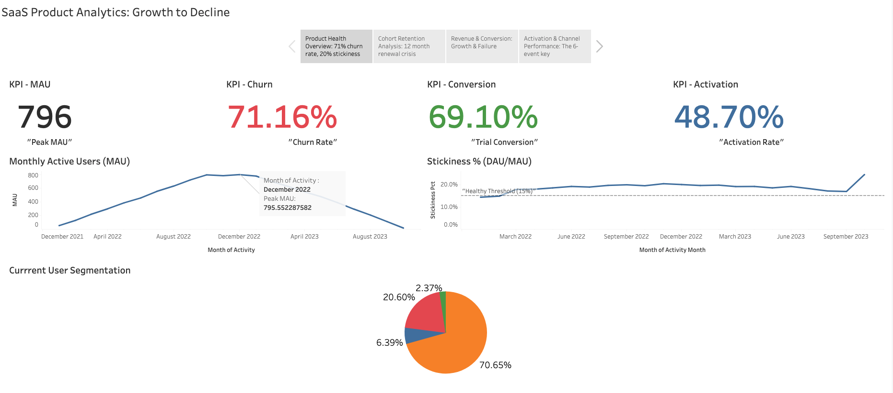

# SaaS Product Analytics: Growth, Retention, & Churn Analysis

**Author:** Alberto Beltran  
**Tools:** Python, PostgreSQL, SQL, Tableau  
**Project Duration:** 7 phases  
**Status:** ✅ Complete

[](https://public.tableau.com/app/profile/alberto.beltran.de.la.torre/viz/SaaSProductAnalyticsDashboard_17747287669060/SaaSProductAnalysis-FullStory)
[](https://github.com/abeltrandlt/saas-product-analytics)

---

## 📊 Interactive Dashboard

**[→ View Live Tableau Dashboard](https://public.tableau.com/app/profile/alberto.beltran.de.la.torre/viz/SaaSProductAnalyticsDashboard_17747287669060/SaaSProductAnalysis-FullStory)**

Explore 4 interactive dashboards covering:
- Product health metrics (MAU, churn, stickiness)
- Cohort retention heatmaps
- Revenue growth analysis (28x MRR growth)
- Activation funnels and channel performance



---

## 🎯 Project Overview

This project analyzes the complete lifecycle of a SaaS product—from explosive growth to catastrophic decline—using PostgreSQL and Tableau. Through cohort analysis, retention curves, and revenue metrics, I uncovered the root cause of a 71% churn rate and identified actionable strategies to prevent future decline.

**Dataset:**
- **1,000 users** across 5 acquisition channels
- **173,000+ events** (login, feature_use, subscription changes)
- **691 paid subscriptions** with realistic upgrade/downgrade patterns
- **Time period:** January 2022 - October 2023 (22 months)

**Key Finding:** Product achieved strong product-market fit (69% conversion, 85% M1-M9 retention, 28x revenue growth) but suffered mass exodus at the 12-month renewal point due to pricing/competitive pressure—not product quality issues.

---

## 💡 Key Insights

### Product Lifecycle Pattern

**Growth Phase (Jan-Oct 2022):**
- 📈 MAU grew 16x (50 → 796 users)
- 💰 MRR increased 28x ($1,742 → $48,844)
- ✅ Stickiness crossed healthy 20% threshold (peaked at 20.38%)
- 🎯 69% trial-to-paid conversion (top 10% of SaaS benchmarks)

**Plateau & Decline (Nov 2022 - Oct 2023):**
- ⚠️ First MoM decline: Nov 2022 (-1.4%)
- 📉 MAU collapsed 98% (796 → 14 users)
- 🚨 71% overall churn rate (catastrophic)
- 💔 All cohorts churned at exactly 12-month renewal

### Root Cause Analysis

**The 12-Month Renewal Pattern:**
- ✅ Months 1-9: 75-85% retention (excellent!)
- ❌ Month 12: Dropped to 58-69% (-15% renewal churn)
- 🎯 **All cohorts churned simultaneously** (Jan cohort → Jan renewal, Feb → Feb renewal)
- 💡 **Conclusion:** Annual subscription renewal crisis, not gradual product decline

**Supporting Evidence:**
- Behavioral signals (events, feature usage) did **NOT** predict churn
- Paid subscribers churned at the same rate as free users (68% vs 73%)
- Events in last 30 days = perfect predictor (0.00 churned vs 1.68 retained)

---

## 📈 Metrics Summary

| Metric | Value | Benchmark | Status |
|--------|-------|-----------|--------|
| **Peak MAU** | 796 | - | - |
| **Stickiness (Peak)** | 20.38% | >15% healthy | ✅ Excellent |
| **Trial Conversion** | 69.10% | 40-60% good | ✅ Top 10% |
| **Activation Rate** | 48.70% | 40-60% good | ✅ Solid |
| **Churn Rate** | 71.16% | 10-30% avg | ❌ Critical |
| **MRR Growth** | 28x in 15mo | - | ✅ Exceptional |
| **M12 Retention** | 58-69% | 40-50% good | ⚠️ High churn |

### Channel Performance

| Channel | Volume | Activation | Conversion | Engagement | Assessment |
|---------|--------|------------|------------|------------|------------|
| **Affiliate** | 4% | 62% ⭐ | 69% | 97 events ⭐ | Best overall |
| Referral | 9% | 55% | 71% | 73 events | Strong |
| Organic | 58% | 48% | 69% | 70 events | Volume leader |
| Paid Search | 21% | 46% | 69% | 62 events | Needs optimization |

**Key Finding:** Affiliate delivers 56% higher engagement than paid search despite 14x lower volume—scale affiliate channel for higher LTV users.

---

## 🎯 Business Recommendations

### Immediate Actions

**1. Fix Renewal Churn (Priority #1)**
- Implement proactive renewal campaigns at M10-M11
- Offer multi-year discounts (lock customers in early)
- "Year in review" value communication before renewal
- **Target:** Reduce 15% renewal churn to 5-10% industry average

**2. Increase Activation Rate (49% → 65%+)**
- Trigger intervention if user has <6 events by day 7 (99% activation predictor)
- Onboarding checklist requiring 3+ features before "completing"
- Reduce 36% never-activated rate to <20%

**3. Scale Affiliate Channel**
- Best metrics across all categories (62% activation, 10.8 days to activate, 5 events week 1)
- Shift budget from paid search → affiliate partnerships
- Recruit specialized affiliates in niche markets

### Product Strategy

**Address "Active Free Rider" Problem:**
- 76% of non-converters had 10+ events (avg 170 events!) but never paid
- Free tier too generous—implement usage limits or feature gates
- Option: 10 events/month cap on free tier after trial

**Improve Onboarding:**
- 36% never activate (only 2 events, <1 feature tried)
- Force feature breadth: require trying 5 features during onboarding
- Reduce time-to-first-feature from 38 days → 7 days

---

## 🗂️ Project Structure
```
saas-product-analytics/
├── tableau/                              # Story and presentation preview
│   ├── SaaS_Analytics_Dashboard.twbx                         
│   └── dashboard-preview.png
├── docs/                                 # End-to-end documentation & Business framing
├── queries/
│   ├── 01_engagement/                    # 5 engagement analysis queries
│   │   ├── data_quality_checks.sql
│   │   ├── dau_mau_stickiness.sql
│   │   ├── feature_usage.sql
│   │   ├── user_segmentation.sql
│   │   └── engagement_trends.sql
│   ├── 02_retention/                     # 5 retention & cohort queries
│   │   ├── cohort_retention.sql
│   │   ├── retention_by_channel.sql
│   │   ├── trial_to_paid_conversion.sql
│   │   ├── churn_prediction.sql
│   │   └── time_to_value.sql
│   └── 03_revenue/                       # Revenue analysis
│       └── mrr_arr_trends.sql
├── scripts/
│   └── generate_saas_data.py             # Python script to generate synthetic data
├── schema.sql                            # PostgreSQL database schema
└── README.md
```

---

## 🔧 SQL Techniques Demonstrated

### Core Skills
- **Window Functions:** RANK, LAG, ROW_NUMBER, PERCENTILE_CONT, moving averages
- **Common Table Expressions (CTEs):** Multi-step query logic, recursive patterns
- **Complex JOINs:** Self-joins, lateral joins, 4+ table joins
- **Date/Time Manipulation:** DATE_TRUNC, EXTRACT, INTERVAL arithmetic, AGE()
- **Aggregations:** COUNT FILTER, conditional aggregation, NULLIF for safe division

### Advanced Patterns
- **Cohort Analysis:** Retention curves, cohort-over-cohort comparisons
- **Funnel Analysis:** Multi-stage conversion tracking
- **Predictive Modeling:** Churn risk scoring with composite indicators
- **Time-Series Analysis:** Trend detection, seasonality checks
- **Data Quality:** Deduplication logic, NULL handling, constraint validation

---

## 📊 Tableau Dashboards

### Dashboard 1: Product Health Overview
**Visualizations:**
- MAU trend line (growth → collapse pattern)
- Stickiness % over time (crossed 20% threshold)
- User segmentation pie chart (71% at-risk visualization)
- KPI cards (Peak MAU: 796, Churn: 71%, Conversion: 69%, Activation: 49%)

**Key Insight:** Product achieved strong engagement metrics but suffered from retention crisis.

---

### Dashboard 2: Cohort Retention Analysis
**Visualizations:**
- Cohort retention heatmap (10 cohorts × 6 time periods)
- Retention curves by activation speed
- Channel retention comparison (all ~98% at 90-day)

**Key Insight:** "Smile curve" pattern—strong M1-M9 retention (75-85%), then -15% drop at M12 renewal across ALL cohorts.

---

### Dashboard 3: Revenue & Conversion Analysis
**Visualizations:**
- MRR growth area chart (28x growth trajectory)
- Revenue mix stacked area (enterprise → professional shift)
- Conversion funnel (1,000 → 487 → 691 → 280)
- Plan distribution donut (starter 69%, pro 26%, enterprise 5%)

**Key Insight:** Professional tier became revenue driver (45% of MRR), but retention failure capped long-term growth.

---

### Dashboard 4: Activation & Channel Performance
**Visualizations:**
- Activation speed distribution (36% never activate)
- 6-event threshold bar chart (99% activation predictor)
- Channel performance scorecard (affiliate dominates)

**Key Insight:** First week engagement is critical—6 events predicts 99% activation, but 36% never reach this threshold.

---

## 🚀 How to Reproduce This Analysis

### 1. Clone Repository
```bash
git clone https://github.com/abeltrandlt/saas-product-analytics.git
cd saas-product-analytics
```

### 2. Set Up PostgreSQL Database
```bash
# Create database
createdb saas_analytics

# Load schema
psql -d saas_analytics -f schema.sql
```

### 3. Generate Synthetic Data
```bash
python scripts/generate_saas_data.py
```

### 4. Run SQL Queries
```bash
# Engagement analysis
psql -d saas_analytics -f queries/01_engagement/dau_mau_stickiness.sql

# Cohort retention
psql -d saas_analytics -f queries/02_retention/cohort_retention.sql

# Revenue metrics
psql -d saas_analytics -f queries/03_revenue/mrr_arr_trends.sql
```

### 5. Build Tableau Dashboard
- Open `tableau/SaaS_Analytics_Dashboard.twbx` in Tableau Desktop/Public
- Or view the published version: [Live Dashboard Link](https://public.tableau.com/app/profile/alberto.beltran.de.la.torre/viz/SaaSProductAnalyticsDashboard_17747287669060/SaaSProductAnalysis-FullStory)

---

## 📚 Documentation

- **[SQL Query Documentation](docs/business_questions.md)** - Each query includes business context and SQL techniques
- **[Data Dictionary](docs/erd_diagram.png)** - Schema definitions and relationships

---

## 🎓 What This Project Demonstrates

**Technical Skills:**
- Advanced SQL (window functions, CTEs, cohort analysis)
- Data modeling and schema design
- Python for data generation
- Tableau for interactive dashboards
- Git version control

**Business Acumen:**
- Product analytics (activation, engagement, retention)
- Revenue metrics (MRR, ARR, ARPU, NRR concepts)
- Cohort analysis and churn prediction
- Channel performance optimization
- Data-driven recommendations

**Communication:**
- Clear documentation
- Business storytelling with data
- Visual design (Tableau dashboards)
- Actionable insights for stakeholders

---

## 📬 Contact

**Alberto Beltran**  
📧 Email: abeltrandlt@gmail.com  
💼 [LinkedIn](https://www.linkedin.com/in/alberto-beltran-analyst)  
💻 [GitHub](https://github.com/abeltrandlt)  
📊 [Tableau Public](https://public.tableau.com/app/profile/alberto.beltran.de.la.torre/vizzes)

---

## 📄 License

This project is open source and available under the [MIT License](LICENSE).

---

## 🙏 Acknowledgments

Dataset generated using Python with realistic SaaS behavioral patterns. Schema design inspired by industry-standard SaaS analytics frameworks. SQL techniques learned through practical application and iteration.

---

*Last Updated: March 2026*
